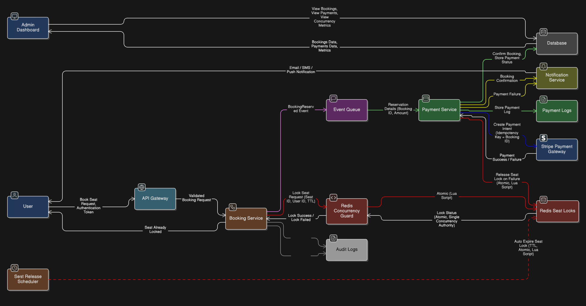

# The “Flash Sale” Concurrency Guard


> **Hackathon Track:** Scalability & High-Performance Systems  
> **Theme:** High-Concurrency Ticketing  
> **Guarantee:** Zero Overbooking — even under same-millisecond clicks

---

## Overview

**The “Flash Sale” Concurrency Guard** is a backend system designed to safely handle **extreme flash-sale traffic** (up to **0.1 million requests/second**) on a **single resource** (e.g., the last available seat) without ever allowing double booking.

Traditional database-centric approaches fail under this load due to race conditions and deadlocks.  
This project solves the problem using **Redis-based distributed locking with Lua scripts**, combined with an **event-driven architecture**, **real-time updates**, and **idempotent payments**.

---

## Problem Statement (User Story)

> _“As a customer, when I select a seat for a high-demand event, I want no same ticket to be booked by two different users — even if they clicked at the same millisecond.”_

---

## Why Traditional Systems Fail

Typical logic: **Check seat availability → Book seat**

Under concurrency, this causes:

- Race conditions
- Double booking
- Database deadlocks
- High latency
- Duplicate payments

---

## Design Goals

- Zero overbooking (hard guarantee)
- Handle 100,000+ requests/sec on a single seat
- Exactly one successful booking
- Idempotent payment processing
- Automatic seat release on timeout/failure
- Real-time seat visibility for all users

---

## Core Principle

> **Never let the database handle high-contention locking**

Instead:

- **Redis** handles concurrency
- **Socket.IO** handles real-time visibility
- **Database** stores final, confirmed state only

---

## High-Level Architecture

```
      Client (Web / Mobile)
            ↓
API Gateway (Rate Limiting, Auth)
            ↓
      Booking Service
            ↓
  Redis (Lua Lock) Socket.IO
            ↓
   Message Queue (Event Driven)
            ↓
    Payment Service (Stripe)
            ↓
  Database (Strong Consistency)
```

---

## Data Flow Diagram (DFD)


---

## Booking Workflow (Step-by-Step)

### 1️. Client Request

- User selects `Seat-A1`
- Sends `POST /book`

---

### 2️. API Gateway

- Applies rate limiting
- Validates authentication
- Protects backend during traffic spikes

---

### 3. Booking Service (Critical Section)

- Does **not** query the database
- Calls a **Redis Lua script**
- Seat is either:
  - Locked instantly
  - Or rejected immediately

---

### 4️. Redis as Distributed Lock Manager

**Why Redis?**

- Single-threaded execution
- In-memory speed
- No interleaving of operations

Example lock: _seat:A1 → userId (TTL = 3 seconds)_

Only **one request across all servers** can create this key.

---

### 5️. Atomic Lua Script Execution

- Lua script runs fully or not at all
- No race window between check & set
- Guaranteed atomicity

Result: _500 parallel requests → 1 success, 499 failures_

---

### 6️. Event-Driven Reservation

After seat lock:

- Emit `BookingReserved` event
- Push to message queue
- Booking service responds immediately

Benefits:

- Non-blocking
- High throughput
- Loose coupling

---

### 7️. Payment Service (Idempotent)

**Problem:**

- Multiple “Pay” clicks
- Network retries
- App crashes & retries

**Solution:**

- Stripe idempotency using `booking_id`

Result:

- Exactly **one charge**
- Safe retries
- No duplicate payments

---

### 8️. Auto-Expiry & Seat Release

- Seat lock has a TTL (e.g., 5 minutes)
- If payment is not completed:
  - Redis key expires
  - Seat becomes available automatically

This prevents:

- Deadlocks
- Stuck inventory
- Manual cleanup jobs

---

## Real-Time Seat Visibility (Socket.IO)

To improve **user trust, transparency, and UX**, the system provides **real-time seat status updates** using **Socket.IO**.

### Seat States

| State         | Meaning                     |
| ------------- | --------------------------- |
| 🟢 Available  | Seat is free                |
| 🟡 Locked     | Seat locked by another user |
| 🔵 In Process | Payment ongoing             |
| 🔴 Booked     | Seat confirmed              |

---

### Real-Time Flow

1. Client connects to Socket.IO
2. Seat status is synced from Redis / DB
3. Seat lock event emitted:
   - `seat_locked`
4. During payment:
   - `seat_processing`
5. On success:
   - `seat_booked`
6. On timeout/failure:
   - `seat_released`

All users see updates **instantly without refresh**.

---

### Fault Tolerance

- Socket.IO is stateless
- Redis is the source of truth
- Reconnect = instant resync
- No impact on concurrency guarantees

---

## Startup Growth & User Incentives

### 1. Group Booking Rewards (3+ Seats)

If a user books **more than 3 seats in one transaction**:

- User receives a **random voucher**
- Possible rewards:
  - Cashback
  - Free popcorn bucket
  - Free soft drinks
  - Discount coupons
  - Surprise rewards

Voucher issued **only after successful payment** to prevent abuse.

---

### 2. Loyalty Points for Individual Bookings

If a user books seats individually:

- Earns **points per seat**
- After **10 total seat bookings**:
  - Eligible for coupons
  - Cashback offers
  - Partner rewards

Encourages:

- Repeat usage
- Long-term loyalty
- Fair rewards for solo users

---

## Concurrency Strategy Explained

### Why Not Database Locks?

| Aspect             | Database Lock |
| ------------------ | ------------- |
| High contention    | ❌            |
| Scales to 100k rps | ❌            |
| Deadlock risk      | ❌            |
| Latency            | ❌            |

### Why Redis + Lua?

| Feature          | Redis |
| ---------------- | ----- |
| Atomic execution | ✅    |
| Single-threaded  | ✅    |
| Distributed      | ✅    |
| Extremely fast   | ✅    |

---

## Load Testing (Definition of Done)

**Tool:** k6

### Test Scenario

- 500 virtual users
- Same endpoint
- Same seat: `Seat-A1`

### Expected Result

- 1 × HTTP 200 → Booking Success
- 499 × HTTP 409 → Seat Already Locked

### Run Test

```bash
k6 run tests/stress_test.js
```

#### Guarantees:

- Zero overbooking
- Stable system under load
- No payment duplication

---

## Core Lua Script (Concurrency Guard)

```
No payment duplication
-- KEYS[1] = seat key (seat:A1)
-- ARGV[1] = userId
-- ARGV[2] = TTL in seconds

local seat = KEYS[1]
local user = ARGV[1]
local ttl = ARGV[2]

if redis.call("EXISTS", seat) == 1 then
    return 0  -- Seat already taken
else
    redis.call("SET", seat, user, "EX", ttl)
    return 1  -- Seat locked successfully
end
```

#### Why this works:

- No check-then-update gap
- No race condition
- Redis guarantees atomicity

---

## Tech Stack

| Layer     | Technology  | Role                            |
| --------- | ----------- | ------------------------------- |
| Runtime   | Node.js     | Backend logic                   |
| Locking   | Redis + Lua | Distributed concurrency control |
| Payments  | Stripe      | Idempotent payment processing   |
| Messaging | Kafka       | Event-driven architecture       |
| Real-Time | Socket.IO   | Live seat status updates        |
| Testing   | k6          | Load & stress testing           |

---

## Definition of Done

- Handles 0.1M req/sec
- Single winner under contention
- Zero overbooking
- Idempotent payments
- Auto seat release
- Real-time seat updates
- Reward & loyalty system
- Stress tested with k6

---

## Why This Design Works

- Production-grade architecture
- Fair & transparent booking
- Strong startup monetization model
- Excellent UX under flash sales
- Designed for extreme concurrency

---

## Contributor

| Contributor | Role |
| ----------- | ---- |
|Deepak Singh Rawat | Backend developer + Redis + Kafka |
|Harikesh Kumar | API + Socket.io + Admin Panel |
|Lalit Nandan | Frontend Devlopment + DFD |
|Aman Singh Kunwar | Frondend Development + UI |

---
